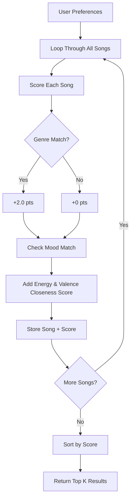
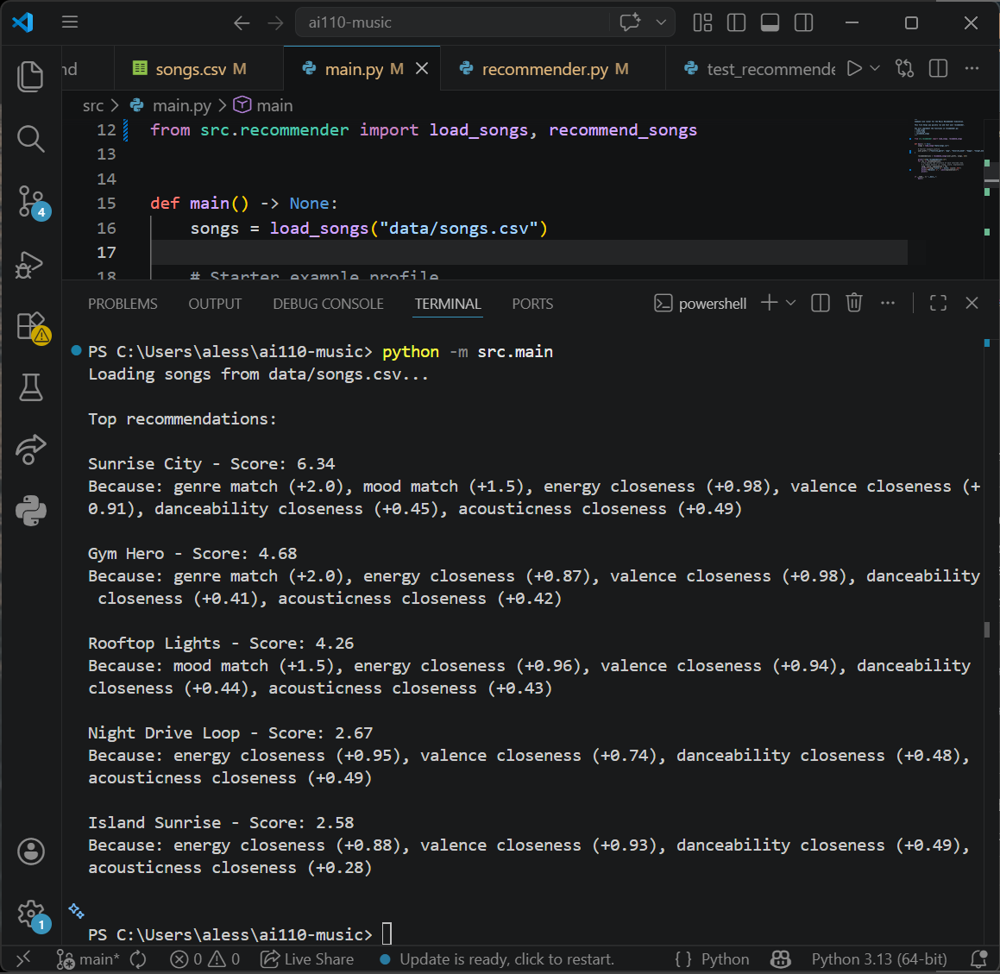
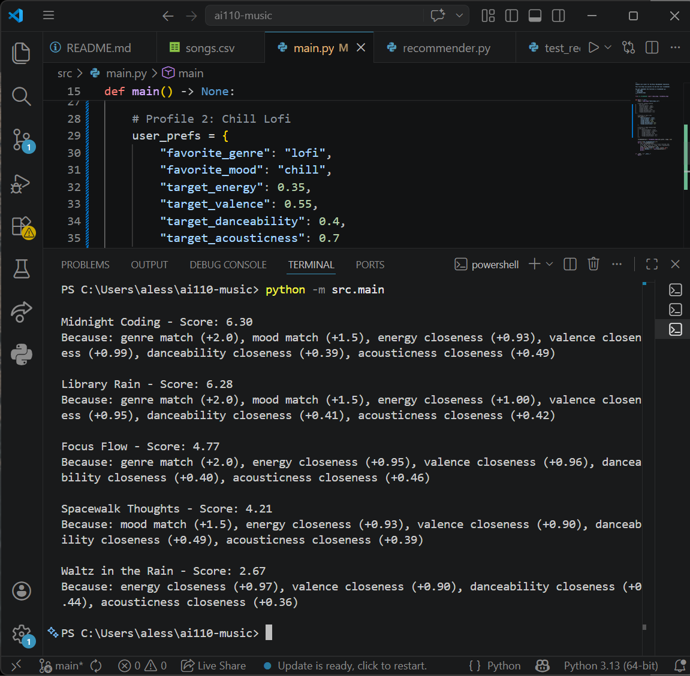
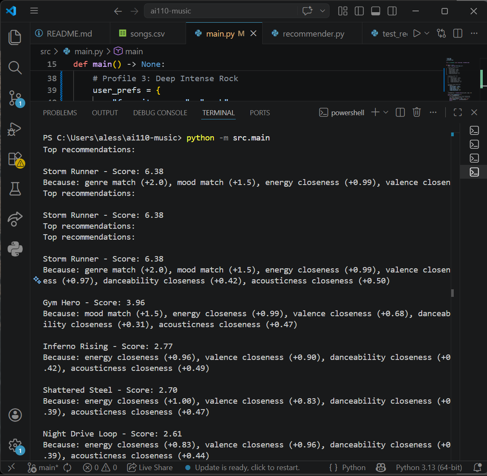

# 🎵 Music Recommender Simulation

## Project Summary

This project is a content-based music recommender built in Python. It takes a user taste profile and scores every song in a catalog based on how closely it matches. The top 5 results are returned with explanations for why each song was recommended. It also supports multiple scoring modes so you can prioritize genre, mood, or energy differently.

---

## How The System Works

Real-world recommenders like Spotify combine two main strategies: matching users with similar listening habits and matching songs by their audio attributes. This simulation uses content-based filtering, scoring every song based on how closely its features match a user's defined taste profile, then returns the top ranked results.

**Song features used:**
- `genre`
- `mood` (happy, chill, relaxed, etc)
- `energy` (0.0–1.0)
- `valence` (0.0–1.0)
- `acousticness` (0.0–1.0)
- `danceability` (0.0–1.0)
- `tempo_bpm` (numeric)

**UserProfile stores:**
- `favorite_genre`
- `favorite_mood`
- `target_energy`
- `target_valence`
- `target_danceability`
- `target_acousticness`

**Algorithm Recipe:**
- +2.0 pts → genre match
- +1.5 pts → mood match
- +1.0 pts → energy closeness (1 - abs(song_energy - target_energy))
- +1.0 pts → valence closeness (1 - abs(song_valence - target_valence))
- +0.5 pts → danceability closeness
- +0.5 pts → acousticness closeness

**Potential bias:** This system may over-prioritize genre, causing it to miss strong mood or energy matches from different genres.



---

## Terminal Output

### Profile 1: Happy Pop


### Profile 2: Chill Lofi


### Profile 3: Deep Intense Rock


---

## Getting Started

### Setup

1. Create a virtual environment (optional but recommended):

```bash
python -m venv .venv
source .venv/bin/activate      # Mac or Linux
.venv\Scripts\activate         # Windows
```

2. Install dependencies:

```bash
pip install -r requirements.txt
```

3. Run the app:

```bash
python -m src.main
```

To switch scoring modes, open `src/main.py` and change:
```python
strategy_name = "genre-first"  # or "mood-first" or "energy-focused"
```

### Running Tests

```bash
pytest
```

---

## Experiments You Tried

### Weight Shift: Energy vs Genre
I doubled the energy weight (1.0 to 2.0) and halved the genre weight (2.0 to 1.0) on the Happy Pop profile.

**Result:** Rooftop Lights jumped from 3rd to 2nd place because its energy matched closely. Gym Hero dropped because it lost the genre bonus. This showed that genre was doing most of the heavy lifting in the original scoring, reducing it gave energy-based matches more room to shine.

**Conclusion:** The original weights make genre too dominant. A more balanced system would give energy and valence more influence.

### Challenge 2: Multiple Scoring Modes
Added three scoring strategies using the Strategy pattern:
- **Genre-First**: Boosts genre weight to 2.5 — genre dominates results
- **Mood-First**: Boosts mood weight to 2.5 — unexpected genres appear if mood matches
- **Energy-Focused**: Boosts energy weight to 2.0 — high energy songs win regardless of genre

---

## Limitations and Risks

- Only works on a small catalog of 18 songs
- Does not understand lyrics or song context
- Genre and mood require exact string matches 
- Over-favors genre by default due to the +2.0 bonus
- Has no memory, it cannot learn from what the user liked or skipped

---

## Reflection

Building this made me realize how much a single number can control an entire system. The genre weight basically decided every result until I started experimenting with it. Real recommenders like Spotify feel smart, but at the end of the day they are doing the same thing just with way more data and much more carefully tuned weights. Bias can sneak in through something as simple as how many songs of each genre are in the dataset.

[**Model Card**](model_card.md)

Write 1 to 2 paragraphs here about what you learned:

- about how recommenders turn data into predictions
- about where bias or unfairness could show up in systems like this


---

## 7. `model_card_template.md`

Combines reflection and model card framing from the Module 3 guidance. :contentReference[oaicite:2]{index=2}  

```markdown
# 🎧 Model Card - Music Recommender Simulation

## 1. Model Name

Give your recommender a name, for example:

> VibeFinder 1.0

---

## 2. Intended Use

- What is this system trying to do
- Who is it for

Example:

> This model suggests 3 to 5 songs from a small catalog based on a user's preferred genre, mood, and energy level. It is for classroom exploration only, not for real users.

---

## 3. How It Works (Short Explanation)

Describe your scoring logic in plain language.

- What features of each song does it consider
- What information about the user does it use
- How does it turn those into a number

Try to avoid code in this section, treat it like an explanation to a non programmer.

---

## 4. Data

Describe your dataset.

- How many songs are in `data/songs.csv`
- Did you add or remove any songs
- What kinds of genres or moods are represented
- Whose taste does this data mostly reflect

---

## 5. Strengths

Where does your recommender work well

You can think about:
- Situations where the top results "felt right"
- Particular user profiles it served well
- Simplicity or transparency benefits

---

## 6. Limitations and Bias

Where does your recommender struggle

Some prompts:
- Does it ignore some genres or moods
- Does it treat all users as if they have the same taste shape
- Is it biased toward high energy or one genre by default
- How could this be unfair if used in a real product

---

## 7. Evaluation

How did you check your system

Examples:
- You tried multiple user profiles and wrote down whether the results matched your expectations
- You compared your simulation to what a real app like Spotify or YouTube tends to recommend
- You wrote tests for your scoring logic

You do not need a numeric metric, but if you used one, explain what it measures.

---

## 8. Future Work

If you had more time, how would you improve this recommender

Examples:

- Add support for multiple users and "group vibe" recommendations
- Balance diversity of songs instead of always picking the closest match
- Use more features, like tempo ranges or lyric themes

---

## 9. Personal Reflection

A few sentences about what you learned:

- What surprised you about how your system behaved
- How did building this change how you think about real music recommenders
- Where do you think human judgment still matters, even if the model seems "smart"

